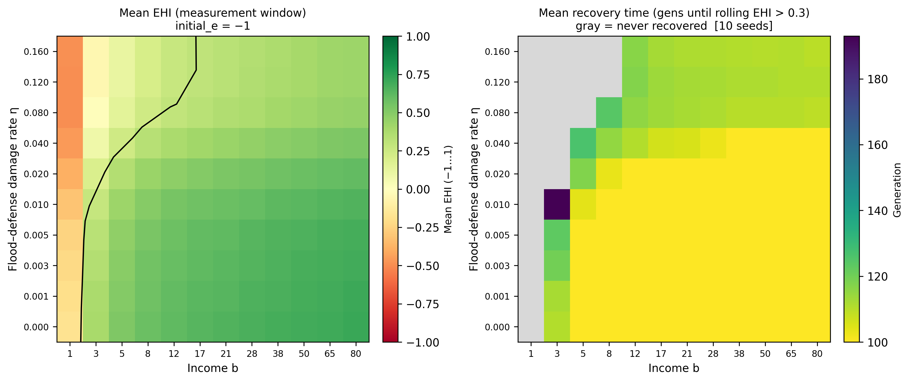

# Spatial Cooperation under Flood Risk

**Philipp Kreiter · Agent-Based Modelling, University of Amsterdam, 2026**

Agent-based model of households maintaining shared flood defences on a spatial lattice. Three strategies — unconditional cooperators (UC), conditional cooperators (CC), and defectors (D) — compete in a threshold public-goods game with environmental feedback linking collective effort to local flood risk.

---

## Key result

Below a critical household income $b_\text{crit}(\eta)$, flood losses outpace earnings before cooperative clusters can form. The environment cannot be repaired and communities get stuck in a poverty trap. Above the threshold, recovery is robust. Investments in the underlying economy emerge as the most effective long-term flood protection strategy.



*Phase portrait of community recovery from a fully degraded initial environment ($e_0 = -1$) across household income $b$ and flood-damage rate $\eta$. Left: mean equilibrium environment index $\bar{e}$ (green = recovered, red = trapped). Right: mean recovery time in generations (grey = no recovery within 1500 generations). Black contour marks $\bar{e} = 0.3$. Parameters: $L=150$, $n_\text{gens}=1500$, $\mu=0.01$, $\delta=\gamma=0.03$, $p_\text{max}=0.5$, $\ell=0.34$.*

---

## Model

Agents sit on an $L \times L$ torus; each belongs to a focal group of 5 (self + 4 von Neumann neighbours). Each generation:

| Step | Description |
|------|-------------|
| **Contribute** | UC pays $\bar{c}$; D pays 0; CC matches neighbours' previous mean contributions |
| **Pool** | Group contributions summed per focal group |
| **Flood check** | Groups clearing threshold $T$ are immune; others face flood probability $p_i = f(e_i)$ |
| **Wealth** | OU income process, minus contribution, minus fractional loss $\ell$ on flood |
| **Environment** | Cooperation repairs defences ($\delta$), neglect degrades ($\gamma$), floods cause additional erosion $\eta$ |
| **Imitation** | Fermi rule — agents copy better-performing neighbours stochastically |

**Model lineage:** Extends Ding et al. (2024) spatial EPGG and Weitz et al. (2016) game-environment feedback with three novelties: threshold flood immunity, a resilience-erosion term ($\eta$), and conditional cooperation as a third strategy following Jonsson & Jonsson (2025).

---

## Results

| Figure | Description |
|--------|-------------|
| [`results/phase_recovery.png`](results/phase_recovery.png) | Phase portrait: recovery vs income $b$ and erosion rate $\eta$ |
| [`results/b_phase.png`](results/b_phase.png) | Order parameters vs $b$ — cooperation fraction, mean EHI, flood rate |
| [`results/osc_summary.png`](results/osc_summary.png) | Oscillatory tragedy of the commons — strategy dynamics and environment |
| [`results/timeseries.png`](results/timeseries.png) | Representative timeseries across three income regimes |
| [`results/figures/sa_sobol_combined.pdf`](results/figures/sa_sobol_combined.pdf) | Sobol first-order and total-effect sensitivity indices |
| [`results/figures/sa_pawn_combined.pdf`](results/figures/sa_pawn_combined.pdf) | PAWN KS sensitivity indices |

---

## Setup

[uv](https://docs.astral.sh/uv/) and Python ≥ 3.13 required.

```bash
uv sync
```

**Single run:**

```bash
uv run spatcoop run-single --L 50 --n-gens 500 --seed 0
```

**Key scripts:**

```bash
# Parameter sweeps (local)
uv run python scripts/sweep_b_phase.py
uv run python scripts/phase_recovery.py

# Sensitivity analysis (Snellius HPC)
sbatch scripts/snellius_sobol_linear.sh
sbatch scripts/snellius_pawn_linear.sh

# Plots
uv run python scripts/plot_osc_summary.py
uv run python scripts/plot_timeseries.py
```

---

## Parameters

| Parameter | Default | Description |
|-----------|---------|-------------|
| `L` | 150 | Lattice side length |
| `c_bar` | 0.75 | UC/CC max contribution |
| `T` | 3.75 | Threshold pool for flood immunity |
| `p_max` | 0.5 | Maximum flood probability |
| `ell` | 0.34 | Flood loss fraction |
| `delta` | 0.03 | Environment repair rate per cooperator |
| `gamma` | 0.03 | Environment degradation rate per defector |
| `eta` | 0.0 | Flood damage to defences (resilience-erosion term) |
| `beta` | 2.0 | Fermi selection strength |
| `b` | 1.0 | Household income multiplier |
| `mu` | 0.01 | Mutation rate |

All parameters defined in [`src/spatcoop/params.py`](src/spatcoop/params.py).

---

## References

- Ding, R. et al. (2024). Evolutionary dynamics in spatial public goods games with environmental feedbacks. *Chaos* 34, 123138.
- Weitz, J. S. et al. (2016). An oscillating tragedy of the commons in replicator dynamics with game-environment feedback. *PNAS* 113, E7518–E7525.
- Jonsson, M. L. & Jonsson, M. (2025). Cooperation in the face of disaster. *PLoS ONE* 20(4), e0318891.
- Pople, A. et al. (2021). The importance of being early: anticipatory cash transfers for flood-affected households. CSAE Working Paper 2021-07.
